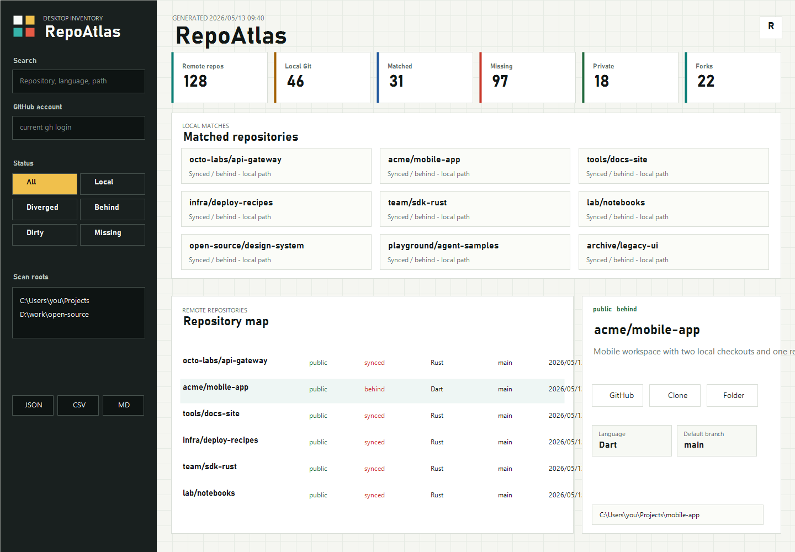
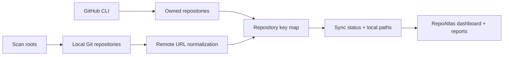

<div align="center">

# RepoAtlas

**A Rust desktop app that maps GitHub repositories to local Git checkouts, highlights drift, and opens the right folder fast.**

[](https://github.com/Harzva/RepoAtlas/releases/latest)
[](https://github.com/Harzva/RepoAtlas/actions/workflows/ci.yml)
[](https://github.com/Harzva/RepoAtlas/releases/latest)
[](LICENSE)
[](https://harzva.github.io/RepoAtlas/)

[Download Windows exe](https://github.com/Harzva/RepoAtlas/releases/latest) ·
[Website](https://harzva.github.io/RepoAtlas/) ·
[Quick Start](#quick-start) ·
[Workflow](#workflow)



</div>

## Why

GitHub accounts and organizations grow messy over time: old forks, private prototypes, local experiments, duplicated clones, and branches that quietly drift from upstream. RepoAtlas gives you one operational view of that reality.

| Question | RepoAtlas answers with |
|---|---|
| Which GitHub repos have local checkouts? | Matched local path counts and folder actions |
| Which local repos are out of sync? | `synced`, `behind`, `ahead`, `diverged`, `dirty`, `no-upstream` |
| Which remotes are not cloned locally? | `no-local-copy` filtering |
| Where is the project folder? | One-click local folder opening |
| How do I export the inventory? | JSON, CSV, and Markdown reports |

## Features

- **Account-neutral GitHub inventory**: uses GitHub CLI to list repositories owned by the active user, or by an optional account/router alias.
- **Local Git mapping**: scans configured folders and matches local remotes by normalized `github.com/owner/repo` keys.
- **Drift detection**: compares local HEAD against upstream and marks dirty worktrees.
- **Desktop actions**: open local folders, copy clone URLs, copy paths, and jump to GitHub.
- **Configurable scans**: set account, scan roots, max depth, and fetch behavior from the UI.
- **Portable reports**: export live JSON, CSV, and Markdown from the local app.

## Quick Start

### Download

1. Open [Latest Release](https://github.com/Harzva/RepoAtlas/releases/latest).
2. Download `RepoAtlas-v0.2.0-x64.exe`.
3. Run the exe.
4. Sign in with GitHub CLI when you want live rescans:

```powershell
gh auth login
```

If the account field is empty, RepoAtlas uses the current `gh` login. If you use a local account-routing helper, enter that alias in the account field.

### Local Development

```powershell
git clone https://github.com/Harzva/RepoAtlas.git
cd RepoAtlas
cargo run
```

Build a release exe:

```powershell
cargo build --release
```

## Workflow



## Configuration

| Variable | Purpose |
|---|---|
| `REPO_ATLAS_ACCOUNT` | Optional GitHub account/router alias. Empty means current `gh` login. |
| `REPO_ATLAS_SCAN_ROOTS` | Scan roots separated by the OS path delimiter. |
| `REPO_ATLAS_MAX_DEPTH` | Directory depth for local Git discovery. Default: `10`. |
| `REPO_ATLAS_DATA` | Writable inventory JSON path. |
| `REPO_ATLAS_NO_FETCH=1` | Skip `git fetch` during scans. |

## Project Structure

```text
.
├── Cargo.toml                 # Rust application manifest
├── src/main.rs                # WebView shell, local API, scanner
├── public/                    # Embedded dashboard UI
├── data/seed-inventory.json   # Empty seed inventory for first launch
├── docs/                      # GitHub Pages site
├── assets/                    # README screenshots
└── .github/workflows/         # CI, Release, and Pages automation
```

## Release Checklist

- CI: `cargo fmt --all -- --check`, `cargo check --locked`, `node --check public/app.js`
- Release: push a `v*` tag to build and upload the Windows exe
- Pages: deploys from `/docs`
- Keep generated inventories free of credentials and private local paths before committing

## License

MIT
