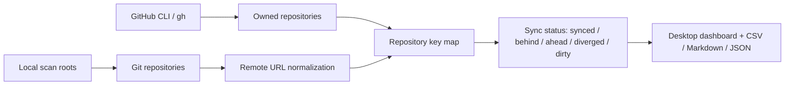

<div align="center">

# Harzva Repo Atlas

**用 Rust 桌面应用把 Harzva 的 GitHub 仓库、本地 Git 副本和同步状态放到一张可操作地图里。**

[](https://github.com/Harzva/harzva-repo-atlas/releases/latest)
[](https://github.com/Harzva/harzva-repo-atlas/actions/workflows/ci.yml)
[](https://github.com/Harzva/harzva-repo-atlas/releases/latest)
[](LICENSE)
[](https://harzva.github.io/harzva-repo-atlas/)

[下载 Windows exe](https://github.com/Harzva/harzva-repo-atlas/releases/latest) ·
[宣传页](https://harzva.github.io/harzva-repo-atlas/) ·
[本地开发](#quick-start) ·
[扫描逻辑](#cartographer-workflow)


</div>

## Why

Harzva 账号下仓库越来越多，很多项目在本地又有多个实验副本、发布副本或历史副本。Repo Atlas 把远端和本地拉到同一个视图里，快速回答这些问题：

| 问题 | Repo Atlas 的回答 |
|---|---|
| 哪些 GitHub 仓库本地有副本？ | 标记本地匹配数量和路径 |
| 本地副本和远端是否一致？ | 显示 `synced`、`behind`、`ahead`、`diverged`、`dirty` |
| 哪些仓库还没 clone？ | `no-local-copy` 筛选 |
| 项目在哪个目录？ | 点击目录按钮直接打开 |
| 怎么导出盘点？ | CSV / Markdown / JSON 动态导出 |

## Features

- **GitHub 仓库盘点**：读取 Harzva 账号拥有的仓库，包含可见性、fork、语言、默认分支、描述和更新时间。
- **本地 Git 映射**：扫描本地目录，按 `github.com/owner/repo` remote 匹配远端仓库。
- **同步状态检测**：支持 `synced`、`behind`、`ahead`、`diverged`、`no-upstream`、`dirty`、`no-local-copy`。
- **桌面管理动作**：打开本地目录、复制 clone URL、复制路径、跳转 GitHub。
- **可配置刷新**：Rust 应用内可设置扫描根目录、扫描深度和是否执行 `git fetch`。
- **报告导出**：动态生成 CSV、Markdown 和 JSON。

## Quick Start

### Download exe

1. 打开 [Latest Release](https://github.com/Harzva/harzva-repo-atlas/releases/latest)。
2. 下载 `Harzva-Repo-Atlas-v0.1.1-x64.exe`。
3. 双击运行。

> Live rescan requires `git` and GitHub CLI `gh`. The app ships with a seed inventory, so the dashboard opens even before rescanning.

### Local development

```powershell
git clone https://github.com/Harzva/harzva-repo-atlas.git
cd harzva-repo-atlas
cargo run
```

Build a release exe:

```powershell
cargo build --release
```

## Cartographer Workflow

Repo Atlas integrates the GH Repo Cartographer workflow into the app:



Implementation notes:

- Uses GitHub CLI to resolve the active login and list owned repositories.
- Uses Git to inspect local branches, upstreams, remotes, and dirty state.
- Uses the local `gh-account-router` helper when available, then falls back to plain `gh`.
- Default account is `Harzva`.
- Default scan roots come from `HARZVA_REPO_SCAN_ROOTS`, otherwise the app tries the current directory and `D:\study\code`.

Useful environment variables:

| Variable | Purpose |
|---|---|
| `HARZVA_REPO_ACCOUNT` | GitHub account alias, default `Harzva` |
| `HARZVA_REPO_SCAN_ROOTS` | Scan roots separated by the OS path delimiter |
| `HARZVA_REPO_MAX_DEPTH` | Directory depth for local Git discovery |
| `HARZVA_REPO_ATLAS_DATA` | Writable inventory JSON path |
| `HARZVA_REPO_NO_FETCH=1` | Skip `git fetch` in CLI scan script |

## Project Structure

```text
.
├─ Cargo.toml                # Rust application manifest
├─ src/main.rs               # WebView shell, local API, scanner
├─ public/                   # Dashboard UI
├─ data/                     # Seed inventory
├─ docs/                     # GitHub Pages site
├─ assets/                   # README screenshots
└─ .github/workflows/        # Release and Pages automation
```

## Current Seed Inventory

The bundled seed snapshot contains:

| Metric | Count |
|---|---:|
| Remote repositories | 85 |
| Local Git repositories scanned | 29 |
| Remote repositories with local matches | 9 |
| Private repositories | 12 |
| Fork repositories | 34 |

## Release Checklist

- CI：`cargo fmt --all -- --check`、`cargo check --locked`、`node --check public/app.js`
- Release：`cargo build --release`
- Push `v*` tag to let GitHub Actions upload the Windows exe
- Publish GitHub Pages from `/docs` through the Pages workflow
- Keep `data/harzva-github-repos.json` free of tokens and credentials

## License

MIT
