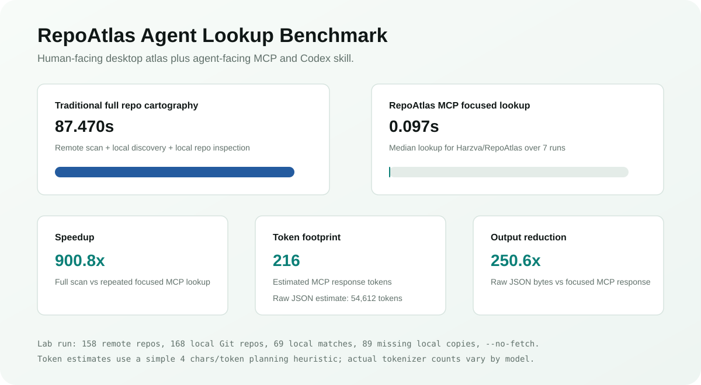
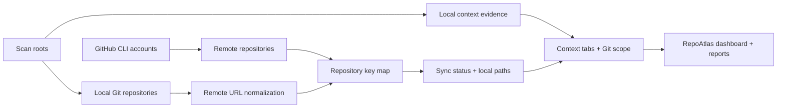

<div align="center">


# RepoAtlas

**A Rust desktop atlas for humans, and a fast repository context layer for agents.**

[](https://github.com/Harzva/RepoAtlas/releases/latest)
[](https://github.com/Harzva/RepoAtlas/actions/workflows/ci.yml)
[](https://github.com/Harzva/RepoAtlas/releases/latest)
[](https://github.com/Harzva/RepoAtlas/releases/latest)
[](LICENSE)
[](https://harzva.github.io/RepoAtlas/)

[Download](https://github.com/Harzva/RepoAtlas/releases/latest) |
[Website](https://harzva.github.io/RepoAtlas/) |
[Install Guide](https://harzva.github.io/RepoAtlas/#install-guide) |
[Demo Video](https://harzva.github.io/RepoAtlas/#demo-video) |
[Agent Tools](#agent-tools) |
[Plugin TODO](https://harzva.github.io/RepoAtlas/#codex-plugin-roadmap) |
[Quick Start](#quick-start) |
[Workflow](#workflow)


</div>

## Demo Video

GitHub README may not render repository-relative `<video>` tags, so the canonical online player lives on GitHub Pages:

[Watch the RepoAtlas demo video](https://harzva.github.io/RepoAtlas/#demo-video)

[Open the raw MP4](assets/repoatlas-promo.mp4) if you want the repository asset directly.

## Why RepoAtlas

GitHub becomes a real context layer only when remote repositories, local folders, account boundaries, and project context tabs are visible in one place. RepoAtlas connects those layers so you can see what exists online, what is cloned locally, what has drifted, and which repositories belong to contexts such as Agents, Memory, Skills, MCP, Workflow, Rules, and Hooks.

RepoAtlas now ships as two products from the same repository:

| Surface | Audience | What it does |
|---|---|---|
| Desktop app / release exe | Humans | Explore accounts, local checkouts, drift, context tags, GitHub details, and exportable reports in a WebView dashboard. |
| MCP server + Codex skill | Agents | Answer focused repository questions from the same inventory without loading full Markdown or JSON reports into context. |

## Highlights

| Capability | What it gives you |
|---|---|
| Multi-account inventory | Scan one or many GitHub accounts or account-router aliases in the same atlas. |
| Local bridge | Match `github.com/owner/repo` remotes to local Git folders and open them from the app. |
| Context tabs | Automatically tag repositories as Agents, Memory, Skills, MCP, Workflow, Rules, Hooks, or Other. A repo can carry multiple tabs. |
| Local context evidence | Scan local Agents/Memory/Skills/MCP/Workflow/Rules/Hooks markers, attach matched evidence to repositories, and keep unlinked contexts in a secondary panel. |
| Drift signals | Show `synced`, `behind`, `ahead`, `diverged`, `dirty`, `no-upstream`, and `no-local-copy`. |
| Themeable dashboard | Switch between Atlas, Midnight, Paper, and Aurora themes. |
| Guided login | Check GitHub CLI status, launch browser login, or set a custom `gh.exe` path from the app. |
| Login+ account access | Add scan accounts, trigger browser auth, or pass a one-time token to GitHub CLI without storing it in RepoAtlas. |
| GitHub live details | Open a repository card to see Issues, Pull Requests, Releases, Pages, Deployments, and Packages with links back to GitHub. |
| Progress feedback | Scan and login operations show visible progress steps instead of a completion-only toast. |
| Portable reports | Export live JSON, CSV, and Markdown reports from the local app. |
| Agent tools | Bundle a Codex skill and stdio MCP server so agents can query repo-to-local mappings without reading full reports. |
| Cross-platform releases | GitHub Actions builds Windows exe and macOS tar.gz assets. |

## Quick Start

> [!IMPORTANT]
> RepoAtlas is a Rust WebView desktop app. Windows users may need the Microsoft Edge WebView2 Runtime; live rescans also require Git and GitHub CLI. If the app opens a blank window or the Login button cannot start authentication, install [WebView2 Runtime](https://developer.microsoft.com/microsoft-edge/webview2/), [Git](https://git-scm.com/downloads), and [GitHub CLI](https://cli.github.com/) first.

### Download

1. Open [Latest Release](https://github.com/Harzva/RepoAtlas/releases/latest).
2. Windows: download `RepoAtlas-vX.Y.Z-windows-x64.exe`.
3. macOS: download `RepoAtlas-vX.Y.Z-macos-ARM64.tar.gz`, extract it, and run `./RepoAtlas` from Terminal.
4. Sign in with GitHub CLI when you want live rescans:

```powershell
gh auth login
```

Leave the account field empty to scan the current `gh` login. Enter multiple accounts or local router aliases on separate lines to merge them into one atlas:

```text
Harzva
saihao
```

### Install Tutorial

| Step | Windows | macOS | Source build |
|---|---|---|---|
| 1. Download | Get `RepoAtlas-vX.Y.Z-windows-x64.exe` from the latest release. | Get `RepoAtlas-vX.Y.Z-macos-ARM64.tar.gz` and extract it. | `git clone https://github.com/Harzva/RepoAtlas.git` |
| 2. Prepare | Install Git, GitHub CLI, and WebView2 Runtime if the window is blank. | Install Git and GitHub CLI. macOS uses system WebKit. | Install stable Rust, Git, GitHub CLI, and platform WebView dependencies. |
| 3. Login | Click `Login` in RepoAtlas or run `gh auth login --web`. | Click `Login` in RepoAtlas or run `gh auth login --web`. | Run `gh auth login --web` before `cargo run` for live scans. |
| 4. Scan | Add accounts and scan roots, then click `Refresh`. | Run `./RepoAtlas`, add accounts and scan roots, then click `Refresh`. | Run `cargo run`, then use the same in-app scan flow. |

Recommended first-run checklist:

- Confirm `git --version` works.
- Confirm `gh --version` works.
- Click `Check` in the RepoAtlas sidebar to verify authentication.
- Click `Login` only when `gh` is installed but not authenticated.
- Use custom `gh.exe` path when you carry a portable GitHub CLI.

### Beginner Login Guide

RepoAtlas does not provide its own GitHub OAuth screen and does not store GitHub secrets. It runs local `gh` commands and reads the result.

| Method | Best for | How it works |
|---|---|---|
| In-app Login button | Most desktop users | Click `Login`, finish the browser flow, then RepoAtlas verifies `gh auth status`. |
| Login+ | Multi-account users | Add an account alias, start browser auth, or pass a one-time token to GitHub CLI. |
| GitHub CLI web login | Terminal users | Run `gh auth login --web`, finish the browser flow, then refresh RepoAtlas. |
| Current `gh` login | Single-account users | Leave the app's GitHub accounts field empty. |
| Multiple account aliases | Users with account routing | Put one account or router alias per line, for example `Harzva` and `saihao`. |
| Custom gh path | Portable CLI users | Set the path to `gh.exe` in the sidebar before login or scan. |
| Token/headless login | Automation or locked-down machines | Configure `gh auth login --with-token` or `GH_TOKEN` outside the app. |

A new user only needs:

- Git installed.
- GitHub CLI installed and authenticated with `gh auth login`.
- Optional GitHub account names or local router aliases.
- Optional scan roots such as `C:\Users\you\Projects` or `D:\work\repos`.
- No token import inside RepoAtlas.

### Local Development

```powershell
git clone https://github.com/Harzva/RepoAtlas.git
cd RepoAtlas
cargo run
```

Build a release binary:

```powershell
cargo build --release
```

## Agent Tools

RepoAtlas includes agent-facing tools under `agent-tools/`:

| Tool | Use it for |
|---|---|
| `agent-tools/mcp/repoatlas_mcp_server.py` | Register a stdio MCP server that answers focused repository lookup questions. |
| `agent-tools/repoatlas-repo-map/` | Install a Codex skill that explains the RepoAtlas repo-map workflow and MCP usage. |
| `agent-tools/gh-repo-cartographer/` | Bundled traditional cartography baseline used by the benchmark. |
| `agent-tools/benchmarks/repoatlas_benchmark.py` | Compare bundled `gh-repo-cartographer` scanning against focused MCP lookup time and token footprint. |
| `agent-tools/README.md` | Copy-ready install snippets and example prompts for agent users. |

Register the MCP server in Codex:

```toml
[mcp_servers.repoatlas]
command = "python"
args = [
  "C:\\path\\to\\RepoAtlas\\agent-tools\\mcp\\repoatlas_mcp_server.py",
  "--inventory",
  "C:\\path\\to\\repo-atlas.json",
]
startup_timeout_sec = 30
```

Then ask the agent:

```text
Find local paths for Harzva/RepoAtlas.
List repositories missing local copies.
Show dirty, ahead, behind, diverged, or no-upstream repositories.
```

Why MCP instead of only a skill: the skill teaches the workflow, while MCP returns small structured answers from the inventory. This saves context tokens and makes repeated repo lookup faster.

### Benchmark

The benchmark below compares the bundled traditional `gh-repo-cartographer` pass with a focused RepoAtlas MCP lookup over the generated inventory.



Benchmark command core parameters:

```powershell
--scan-root "<workspace-root>" --no-fetch --query "Harzva/RepoAtlas" --repeat-mcp 7
```

The measured lab run used one Windows workspace root containing the local repository collection.

| Metric | Result |
|---|---:|
| Remote repositories | 158 |
| Local Git repositories | 168 |
| Local matches | 69 |
| Missing local copies | 89 |
| Traditional full scan | 87.470s |
| Remote scan phase | 13.373s |
| Local Git discovery phase | 14.014s |
| Local repo inspection phase | 59.933s |
| RepoAtlas MCP lookup median | 0.097s |
| Focused lookup speedup | 900.8x |

| Output | Estimated tokens |
|---|---:|
| Traditional Markdown report | 8,920 |
| Traditional raw JSON inventory | 54,612 |
| MCP focused response | 216 |

The raw JSON inventory is about 250.6x larger than the focused MCP response for this lookup. The local benchmark output is intentionally ignored by Git because it contains machine-specific local paths; rerun `agent-tools/benchmarks/repoatlas_benchmark.py` to reproduce the report.

## Workflow



## Context Tabs

RepoAtlas ships with automatic context inference so a repository collection can become a usable agent-context map without stopping being repository-centered. Repositories can carry multiple tabs, so an `AGENTS.md` project can appear under both Agents and Rules, while a local MCP skill pack can appear under both Skills and MCP.

| Tab | Typical signals |
|---|---|
| Agents | `.codex/`, `.claude/`, `.agents/`, `agents/`, `AGENTS.md`, `CLAUDE.md`, agent/codex/claude naming. |
| Memory | `memory/`, `memories/`, `memory-bank/`, `knowledge/`, `MEMORY.md`, RAG/vector/knowledge wording. |
| Skills | Codex skills, agent skills, local `.codex/skills` style projects. |
| MCP | MCP servers, connectors, model-context-protocol tooling. |
| Workflow | `.github/workflows/`, `workflow(s)`, GitHub Actions, CI/CD wording. |
| Rules | `.cursor/rules/`, `.cursorrules`, `rules/`, `RULES.md`, `AGENTS.md`, `CLAUDE.md`. |
| Hooks | `.githooks/`, `hooks/`, `.pre-commit-config.yaml`, pre-push/webhook tooling. |
| Other | Repositories without a confident context signal. |

## Configuration

| Variable | Purpose |
|---|---|
| `REPO_ATLAS_ACCOUNTS` | Optional comma/semicolon/newline separated account or router aliases. |
| `REPO_ATLAS_ACCOUNT` | Backward-compatible single account alias. |
| `REPO_ATLAS_SCAN_ROOTS` | Scan roots separated by the OS path delimiter. |
| `REPO_ATLAS_MAX_DEPTH` | Directory depth for local Git discovery. Default: `10`. |
| `REPO_ATLAS_DATA` | Writable inventory JSON path. |
| `REPO_ATLAS_NO_FETCH=1` | Skip `git fetch` during scans. |

## Project Structure

```text
.
|-- Cargo.toml                 # Rust application manifest
|-- src/main.rs                # WebView shell, local API, scanner
|-- public/                    # Embedded dashboard UI
|-- data/seed-inventory.json   # Empty seed inventory for first launch
|-- agent-tools/               # Codex skill and MCP server for agent lookup
|-- docs/                      # GitHub Pages site
|-- assets/                    # README visuals
`-- .github/workflows/         # CI, Release, and Pages automation
```

## Release Checklist

- CI: `cargo fmt --all -- --check`, `cargo check --locked`, `node --check public/app.js`
- Release: push a `v*` tag to build Windows and macOS assets
- Pages: deploys from `/docs`
- Keep generated inventories free of credentials and private local paths before committing

## License

MIT
