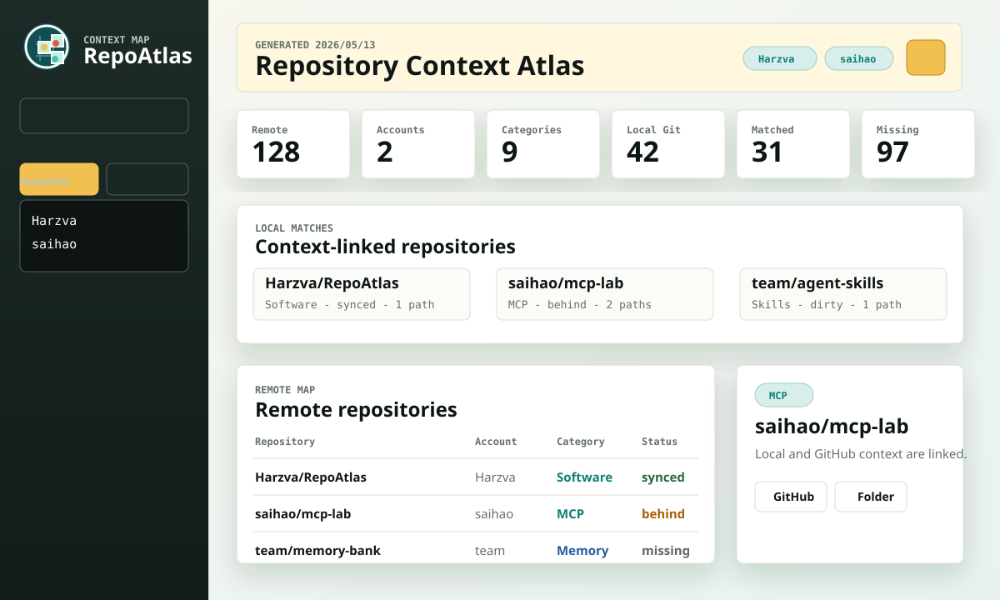
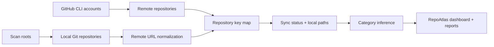

<div align="center">


# RepoAtlas

**A Rust desktop atlas for managing multiple GitHub accounts, local Git checkouts, sync drift, and repository context categories.**

[](https://github.com/Harzva/RepoAtlas/releases/latest)
[](https://github.com/Harzva/RepoAtlas/actions/workflows/ci.yml)
[](https://github.com/Harzva/RepoAtlas/releases/latest)
[](https://github.com/Harzva/RepoAtlas/releases/latest)
[](LICENSE)
[](https://harzva.github.io/RepoAtlas/)

[Download](https://github.com/Harzva/RepoAtlas/releases/latest) |
[Website](https://harzva.github.io/RepoAtlas/) |
[Quick Start](#quick-start) |
[Workflow](#workflow)



</div>

## Why RepoAtlas

GitHub becomes a real context layer only when remote repositories, local folders, account boundaries, and project categories are visible in one place. RepoAtlas connects those layers so you can see what exists online, what is cloned locally, what has drifted, and which repositories belong to categories such as Skills, MCP, Memory, Software, Docs, Infra, and Research.

## Highlights

| Capability | What it gives you |
|---|---|
| Multi-account inventory | Scan one or many GitHub accounts or account-router aliases in the same atlas. |
| Local bridge | Match `github.com/owner/repo` remotes to local Git folders and open them from the app. |
| Context categories | Automatically classify repositories into Skills, MCP, Memory, Software, Docs, Infra, Data, Research, Games, or Other. |
| Drift signals | Show `synced`, `behind`, `ahead`, `diverged`, `dirty`, `no-upstream`, and `no-local-copy`. |
| Themeable dashboard | Switch between Atlas, Midnight, Paper, and Aurora themes. |
| Portable reports | Export live JSON, CSV, and Markdown reports from the local app. |
| Cross-platform releases | GitHub Actions builds Windows exe and macOS tar.gz assets. |

## Quick Start

### Download

1. Open [Latest Release](https://github.com/Harzva/RepoAtlas/releases/latest).
2. Windows: download `RepoAtlas-vX.Y.Z-windows-x64.exe`.
3. macOS: download `RepoAtlas-vX.Y.Z-macos-ARM64.tar.gz`, extract it, and run `./RepoAtlas` from Terminal.
4. Sign in with GitHub CLI when you want live rescans:

```powershell
gh auth login
```

Leave the account field empty to scan the current `gh` login. Enter multiple accounts or local router aliases on separate lines to merge them into one atlas:

```text
Harzva
saihao
```

### Beginner Login Guide

RepoAtlas does not provide its own GitHub OAuth screen and does not store GitHub secrets. It runs local `gh` commands and reads the result.

| Method | Best for | How it works |
|---|---|---|
| GitHub CLI web login | Most desktop users | Run `gh auth login --web`, finish the browser flow, then refresh RepoAtlas. |
| Current `gh` login | Single-account users | Leave the app's GitHub accounts field empty. |
| Multiple account aliases | Users with account routing | Put one account or router alias per line, for example `Harzva` and `saihao`. |
| Token/headless login | Automation or locked-down machines | Configure `gh auth login --with-token` or `GH_TOKEN` outside the app. |

A new user only needs:

- Git installed.
- GitHub CLI installed and authenticated with `gh auth login`.
- Optional GitHub account names or local router aliases.
- Optional scan roots such as `C:\Users\you\Projects` or `D:\work\repos`.
- No token import inside RepoAtlas.

### Local Development

```powershell
git clone https://github.com/Harzva/RepoAtlas.git
cd RepoAtlas
cargo run
```

Build a release binary:

```powershell
cargo build --release
```

## Workflow



## Categories

RepoAtlas ships with automatic category inference so a repository collection can become a usable context map.

| Category | Typical signals |
|---|---|
| Skills | Codex skills, agent skills, local `.codex/skills` style projects. |
| MCP | MCP servers, connectors, model-context-protocol tooling. |
| Memory | Memory banks, knowledge systems, RAG, vector stores, notes. |
| Software | Desktop apps, CLIs, tools, extensions, release utilities. |
| Docs | Documentation, websites, roadmaps, course material. |
| Infra | Workflows, CI, deployment, Docker, routers, config. |
| Data | Datasets, corpora, benchmarks, CSV/JSONL collections. |
| Research | Papers, models, LLM/NLP/agent experiments. |

## Configuration

| Variable | Purpose |
|---|---|
| `REPO_ATLAS_ACCOUNTS` | Optional comma/semicolon/newline separated account or router aliases. |
| `REPO_ATLAS_ACCOUNT` | Backward-compatible single account alias. |
| `REPO_ATLAS_SCAN_ROOTS` | Scan roots separated by the OS path delimiter. |
| `REPO_ATLAS_MAX_DEPTH` | Directory depth for local Git discovery. Default: `10`. |
| `REPO_ATLAS_DATA` | Writable inventory JSON path. |
| `REPO_ATLAS_NO_FETCH=1` | Skip `git fetch` during scans. |

## Project Structure

```text
.
|-- Cargo.toml                 # Rust application manifest
|-- src/main.rs                # WebView shell, local API, scanner
|-- public/                    # Embedded dashboard UI
|-- data/seed-inventory.json   # Empty seed inventory for first launch
|-- docs/                      # GitHub Pages site
|-- assets/                    # README visuals
`-- .github/workflows/         # CI, Release, and Pages automation
```

## Release Checklist

- CI: `cargo fmt --all -- --check`, `cargo check --locked`, `node --check public/app.js`
- Release: push a `v*` tag to build Windows and macOS assets
- Pages: deploys from `/docs`
- Keep generated inventories free of credentials and private local paths before committing

## License

MIT
